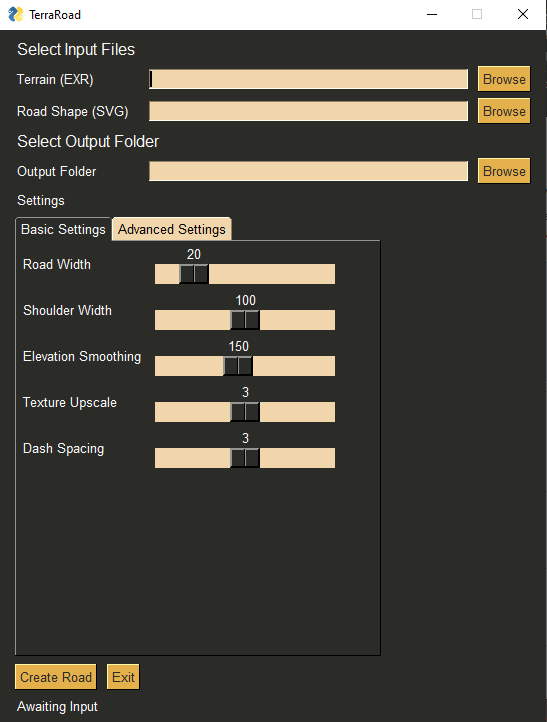

# TerraRoad

TerraRoad is a Terragen road creator!  It combines a heightfield exported from Terragen with an svg path defining a road shape, and creates a new heightfield with the road path leveled and smoothed.  The tool also creates a variety of masks that can be used in Terragen for shading the road and shoulder.  


## Installation

To use TerraRoad, you'll need Python installed on your computer.  On Windows, Python can be obtained easily through the [Microsoft Store](https://www.microsoft.com/en-us/p/python-39/9p7qfqmjrfp7), or for Windows, Mac, and Linux from [python.org](https://www.python.org/downloads/).  Make sure to check 'Add Python to Path' if installing manually.

Once Python is installed, open the command prompt (not IDLE) and use the Python package manager [pip](https://pip.pypa.io/en/stable/) to install the packages needed to run TerraRoad.

```bash
pip install pysimplegui imageio numpy scipy scikit-image svgpathtools
```

NOTE: The ImageIO library needs an additional plugin called freeimage to read EXR files.  I'll try to add an automatic check into the code for that.  Until then, you can run this code in a Python interpreter to download the plugin:

```
import imageio
imageio.plugins.freeimage.download()
```

Now you are ready to download TerraRoad.  TerraRoad is contained in a single Python script, *TerraRoad.py*, which you can download by clicking the green 'Code' button above, and then 'Download ZIP'.  Unzip the folder, and navigate to the unzipped folder in your command prompt.  Launch TerraRoad by running:

```
python TerraRoad.py
```



You can also run TerraRoad through IDLE or your favorite Python IDE.  

## Usage

### Input files
TerraRoad requires two input files.  
* The first is a heightfield in .exr format.  This can be obtained in Terragen 
by connecting a terrain to the Shader input of the 'Heightfield Generate Node', 
generating a heightfield, and then right clicking the node and saving as EXR.
I recommend starting out with a 1 pixel/meter resolution, since all TerraRoad measurements are
in pixels.
* The second input is an SVG file with a single path (for now) defining the road shape.  I created
mine in Affinity Photo.  First I converted my heightfield EXR to a JPEG so I could see it better,
then I used the Pen tool in "Smart Mode" to create a path along the terrain.  I then hid all the layers
except for the path (not sure if this is necessary), and saved as an SVG file.

### Using TerraRoad
Once the input files are ready, launch TerraRoad it's python script as described above.  You should see a little
window appear with some buttons and sliders.  Use the buttons to select your EXR and SVG, and then select a folder
where the output files will be placed.  Click 'Create Road', and wait for your road to build.  This can take several minutes
depending on your settings and heightfield resolution.  The output folder should open automatically when complete.

### Output Files
Eventually there will be docs with some pictures explaining these better.
+ terrain_with_road.tif - Heightfield with road added, ready for import into Terragen.
+ masks_road - Mask of road surface
+ masks_shoulder - Mask of road surface and shoulder
+ masks_shoulder_fade - Soft mask of road surface, and shoulder with gradient reaching only to the road
+ masks_road_and_shoulder_fade - Soft mask of road and shoulder with gradient reaching all the way to the center
+ masks_center_line - Mask for center paint line
+ masks_center_line_with_dashes - Mask for dashed version of center paint line
+ masks_side_lines - Mask for two lines on side of road
+ masks_cut - Mask for shoulder area above the road surface
+ masks_fill - Mask for shoulder area below the road surface

### Settings
Future versions will expose more settings.  These are the basics.
+ Road Width - Width in pixels of the area that will be leveled along the svg path.
+ Shoulder Width - Width in pixels (from the road center) of the area that will be smoothed and blended along the edge of the road.
+ Elevation Smoothing - Controls how closely the road will follow displacements in the terrain.  High values will cause the road to cut through mountains and bridge valleys.
+ Mask Upscaling - Mask resolution will be this value multiplied by the 

## Example Files

There are some example files included, a sample road svg, and a basic Terragen scene showing some ideas for using the resulting masks.  To generate a heightfile from the sample scene, open the node 'Heightfield generate 01', and click Generate Now.  Then right click on the node, and click 'Save file as' and save as an EXR image.  For more help on exporting terrains from Terragen, see [this video](https://www.youtube.com/watch?v=NTlhqIs89ZI&ab_channel=TerraTuts).


## Contributing
Pull requests are welcome. For major changes, please open an issue first to discuss what you would like to change.
